# Operationalizing Machine Learning with Microsoft Machine Learning Studio

## Overview

In a typical Machine Learning application, like it happens for any software product, it's critical to bring the application into production, monitor it, and update it when needed. The process of automating the process of getting software into production is named **DevOps**. Thanks to the Microsoft Azure environment, we can **automate** the process of productionizing any **Machine Learning Application** by using the **MLOps (Machine Learning Operations)** features provided by the environment, that is the application of the **DevOps** best-practices and principles to the **Machine Learning Operations**.

Below is the list of steps to operationalize a **Machine Learning Application**:

1. Create a **Dataset** with the data of the problem we want to study
2. Create a **Model** leveraging the **Automated ML** feature
3. Deploy the **Model** and create an **Endpoint** to interact with the model
4. Consume the **Endpoint**
5. Create a **Pipeline** in Python SDK using **Jupyter Notebook** on a **Python 3 Environment**

The **Dataset** contains data about a **Bank Marketing** campaign, and the **goal** of the **model** is to predict if a **client** is going to subscribe (the target variable is indicated as **y** which can be "yes" or "no"). The finite number of states of the target variable is a good fit for using a **Classification** algorithm.

## Architectural Diagram
For this project, I went through two methods to create and deploy a **Machine Learning** model:

* Using the **Azure Machine Learning AutoML UI**
* Using a **Jupyter Notebook** to create a **Pipeline** with **AutoMLStep**, and then deploy and consume it

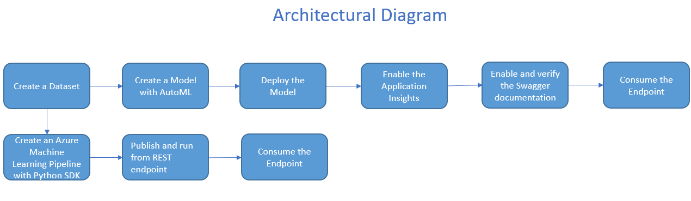

The first thing I did was to create a **Dataset** in **Azure** to hold the data to train the **Models**. The first path started with training a **Model** with **AutoML UI**. Once the **AutoML** completed, I've deployed the **Best Model** in an **ACI (Azure Container Instance)** enabling the **Application Insights** for logging. Next, I've checked that the **Swagger** service worked as intended by providing the **documentation** to interact with the **endpoint**. Lastly, I've consumed the **Endpoint** to check the answer. As for the **Pipeline**, I've taken advantage of a **Python 3** environment to run the code in a **Jupyter Notebook** to create a pipeline with **AutoMLStep**. After creating the **Pipeline**, I've deployed it and consumed it to verify it replied as intended.

## Key Steps - Automated ML

Below are the steps involved in the process:

* Select and upload the Dataset
* Create a New Automated ML run
* Configure a new compute cluster using a **Standard_DS12_V2** with 1 as the minimum number of nodes
* Run the experiment using **Classification**, ensuring the **Explain Best Model** is checked
* Deploy the **Best Model** found by the **Automated ML** experiment using an **ACI (Azure Container Instance)**
* Enable the **Application Insights** to enable logging
* Interact with the **Swagger** instance runnin the documentation for the **HTTP API** of the model
* Consume the model

### Description

#### Select and upload the Dataset
Register the dataset with data from the URL: [https://automlsamplenotebookdata.blob.core.windows.net/automl-sample-notebook-data/bankmarketing_train.csv](https://automlsamplenotebookdata.blob.core.windows.net/automl-sample-notebook-data/bankmarketing_train.csv)
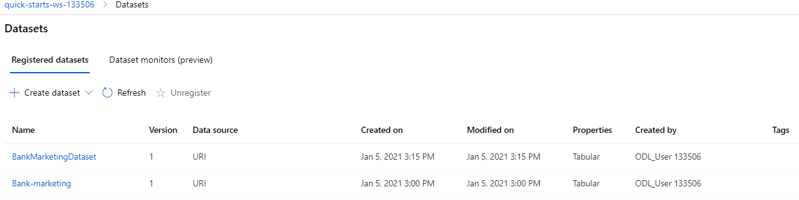

There are two datasets, because one was already there in the VML created by the LAB, but I've created the Dataset by myself anyway (using the URL indicated above).

#### Create a New Automated ML Run
The **experiment** has been created using the **Automated ML** feature available in the environment, without writing a single line of code. The experiment has been fed with the data of the **dataset** created in the step above, and I ran it by creating a **compute cluster** using a **Standard_DS12_V2** configuration. Below is the image that shows the **experiment** completed successfully.

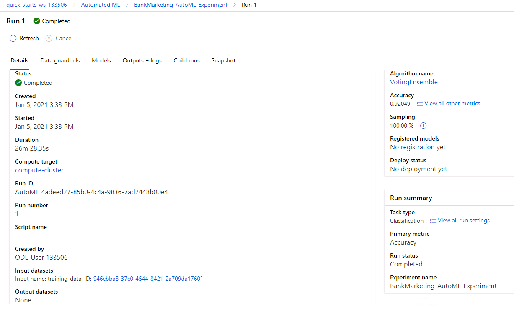

#### Check the Best Model
The **experiment** found a **Best Model** after completion, and it can be found at the top of the list of all models tested by the **Automated ML**.

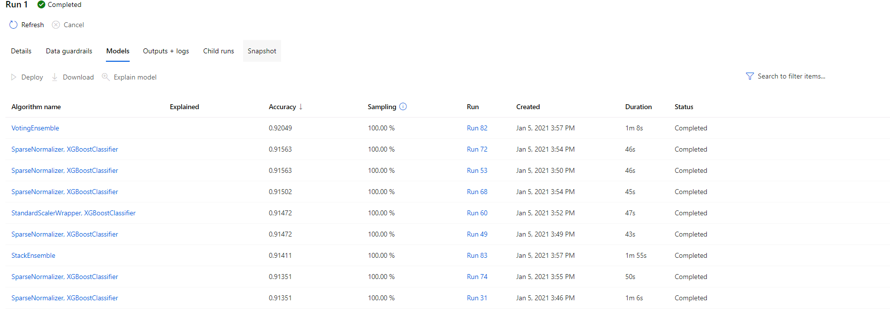
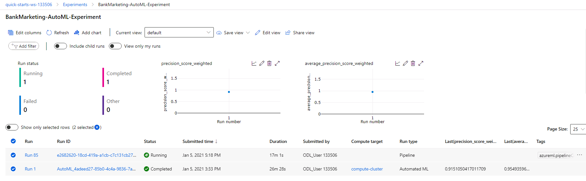
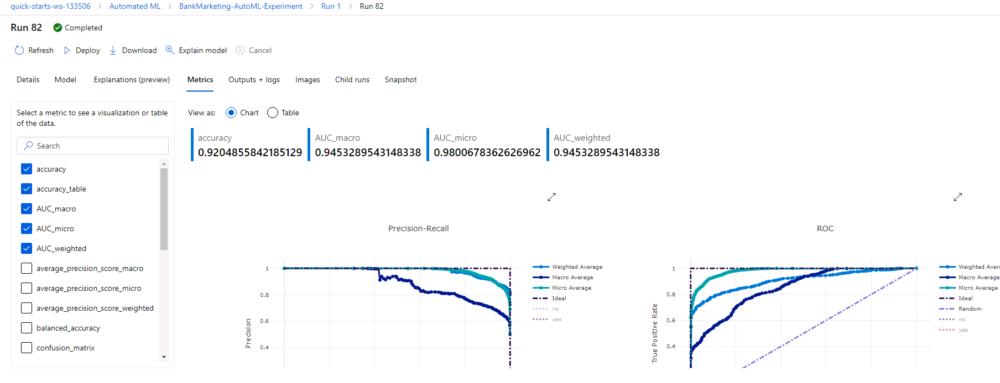

#### Deploy model and enable the Application Insights
The **Best Model** found with the experiment is deployed to be able to interact with the **HTTP API** service and with the **Model** itself with **POST** requests, and the **Application Insights** has been enabled using the **logs.py** script.

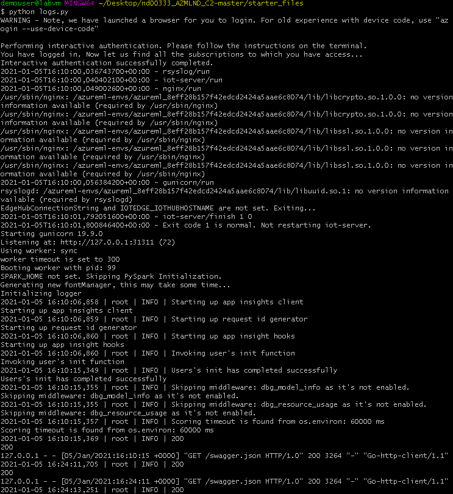

Below is the image that shows the **Application Insight** is enabled.

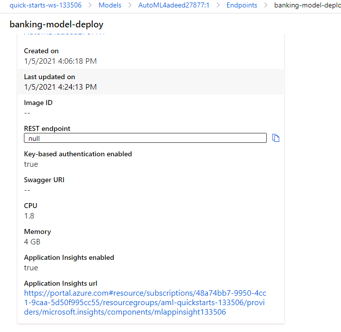

#### Swagger Documentation
**Swagger** is a tool that helps build, document, and consume RESTful web services like the ones you are deploying in Azure ML Studio. It further explains what types of HTTP requests that an API can consume, like `POST` and `GET`. Azure provides a `swagger.json` that is used to create a web site that documents the HTTP endpoint for a deployed model. 

* Swagger Running
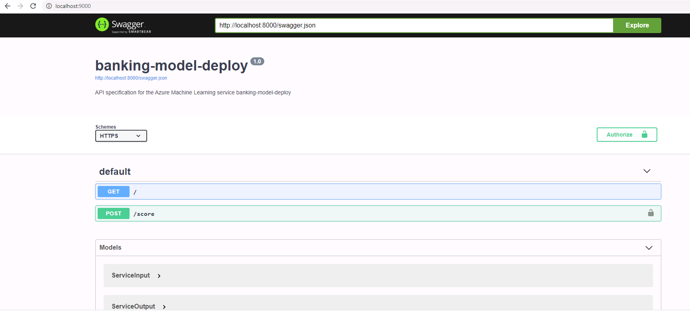

* POST
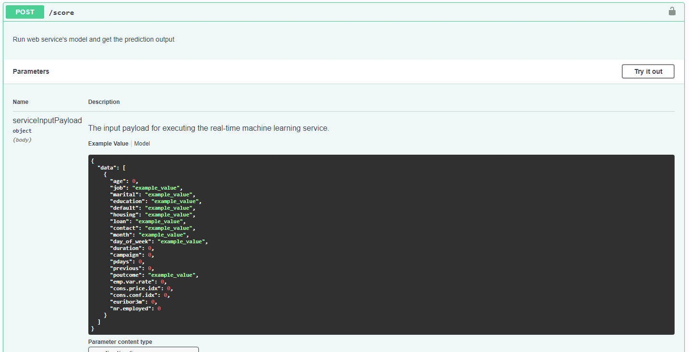

* GET
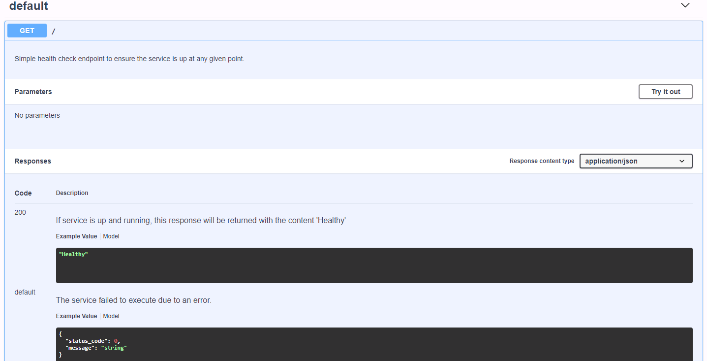

#### Consume the model Endpoint
I've used the **endpoint.py** script to interact with the **endpoint**. The **script** sends a post request and receives a response in **JSON Format** that is displayed below.

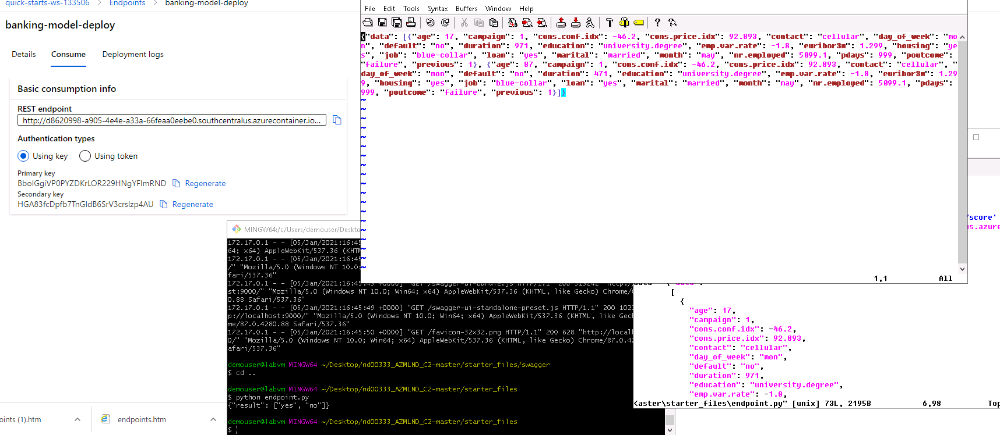

## Key Steps - Pipeline

Below are the steps involved in the process:

* Create a pipeline in Python SDK
* Publish the pipeline in Python SDK
* Consume the pipeline in Python SDK

#### Create a pipeline
The pipeline is created in **Python** in a **Jupyter Notebook**.

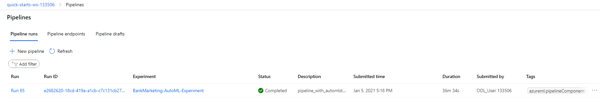

#### Bankmarketing Dataset with AutoML module

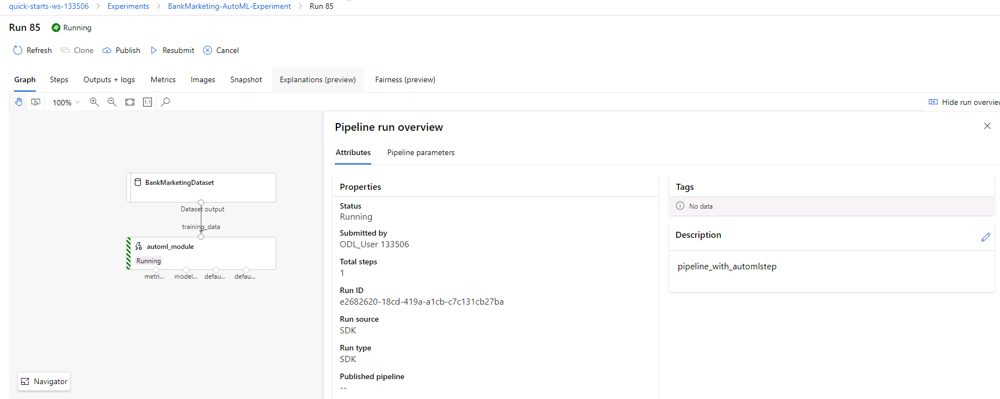

#### “Published Pipeline overview”, showing a REST endpoint and a status of ACTIVE

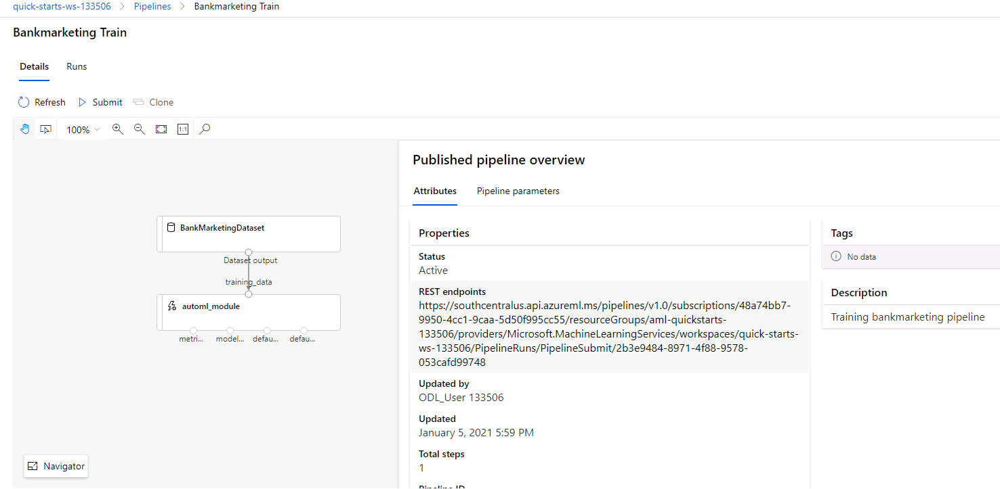

#### “Use RunDetails Widget” with the step runs

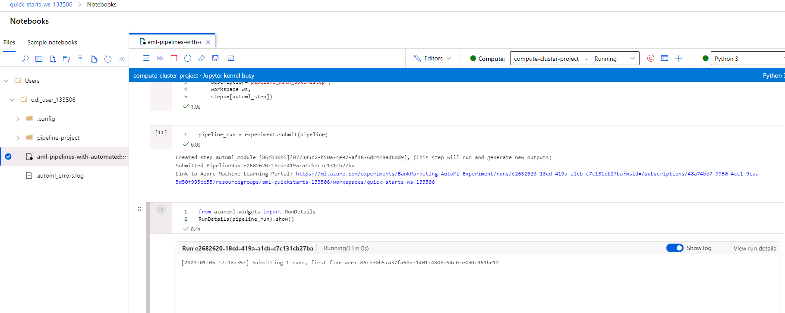

#### ML studio showing the pipeline endpoint as Active

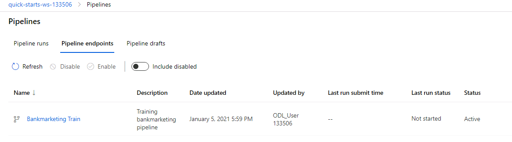

#### ML studio showing the scheduled run

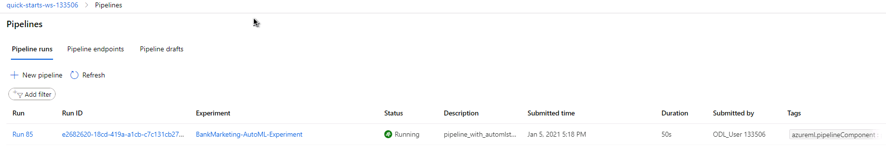

## Screen Recording
YouTube: [https://youtu.be/ypHial41bQg](https://youtu.be/ypHial41bQg)

## Possible Future Improvements
Future improvements can be done by:
* Training the **Model** with a larger dataset by collecting more data from the **Bank Marketing** campaign
* Working more on the **Data Preparation** and integrate features used for this project with other features perhaps calculated by aggregating data
* Setting the `enable_early_stopping` to `false` to see if it helps to improve the score
* Setting the `featurization` parameter to [FeaturizationConfig](https://docs.microsoft.com/en-us/python/api/azureml-automl-core/azureml.automl.core.featurization.featurizationconfig.featurizationconfig?view=azure-ml-py) to define our customized feature engineering configuration
